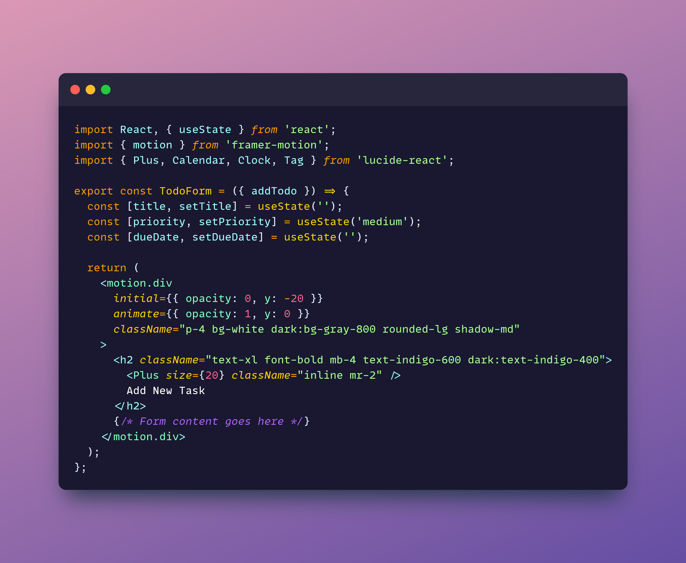
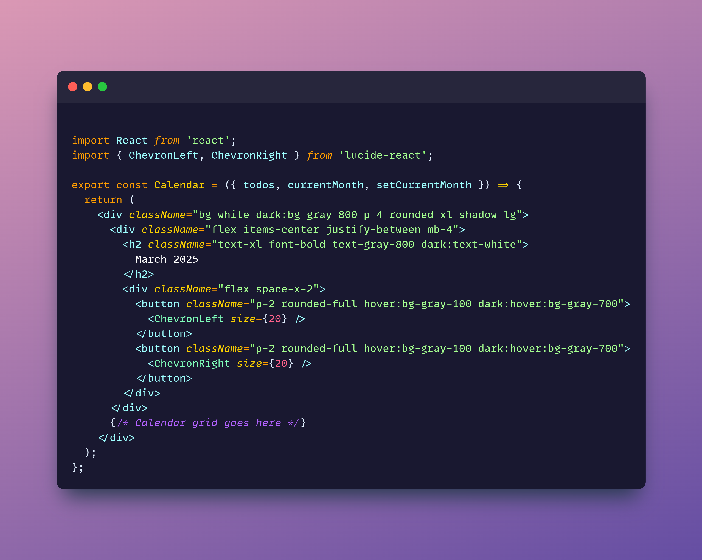

# 🌟 Ultimate Todo App ✨


## 🎯 Features That Will Blow Your Mind 🤯

- ✅ Task Management - Create, edit, and crush your tasks
- 🔄 Status Tracking - Watch your progress in real-time
- 🔥 Priority Levels - From "Meh" to "DO IT NOW!!!"
- ⏰ Smart Due Dates - Never miss a deadline again
- 📋 Subtasks Support - Break down monster tasks into bite-sized pieces
- 📂 Custom Categories - Organize like a boss
- ⭐ Important Tasks - Star the VIPs (Very Important Projects)
- 🔍 Turbo Search - Find anything in milliseconds
- 📊 Beautiful Stats - Data visualization that actually looks good
- 📅 Calendar View - See your month at a glance
- 🌓 Dark/Light Mode - Switch sides whenever you want
- 🔔 Notifications - We'll remind you (nicely)


## 🛠️ Tech Stack of Champions 🏆

```bash
React + TypeScript + Tailwind CSS = PRODUCTIVITY SUPERPOWER
```

- ⚛️ React - For that smooth, component-based life
- 📘 TypeScript - Because types are your friends
- 🎨 Tailwind - Styling at the speed of thought
- ✨ Framer Motion - Animations that impress
- 🧩 Lucide Icons - Pretty little symbols everywhere
- 🚀 Vite - Development at light speed

## 📸 Code Showcase

Here's what our amazing components look like:

### 🌈 TodoForm Component



### 🎨 ProgressMeter Component


### 🗓️ Calendar Component



## 📊 App in Action


## 🚀 Get Started in 3... 2... 1...

## Prerequisites 📋

- Node.js (v14+)
- npm or yarn
- A desire to be productive! 💪

## Launch Sequence 🚀

```bash
# Clone this magnificent repo
git clone https://github.com/yourusername/todo-app.git

# Enter the productivity zone
cd todo-app

# Install the magic
npm install
# or
yarn install

# 3... 2... 1... LIFTOFF!
npm run dev
# or
yarn dev
```

Then visit `http://localhost:5173` and prepare to be amazed! 🤩

## 🌈 Color Guide

| Element | Light Mode | Dark Mode |
|---------|------------|-----------|
| 🏮 Primary | `#4F46E5` | `#818CF8` |
| 🔶 Secondary | `#EC4899` | `#F472B6` |
| 📗 Success | `#10B981` | `#34D399` |
| ⚠️ Warning | `#F59E0B` | `#FBBF24` |
| 🚨 Danger | `#EF4444` | `#F87171` |
| 📄 Background | `#FFFFFF` | `#1F2937` |
| 📝 Text | `#111827` | `#F9FAFB` |

## 🤝 Join the Todo Revolution!

1. Fork it! 🍴
2. Create your feature branch: `git checkout -b feature/amazing-idea`
3. Commit your changes: `git commit -am '✨ Add this amazing feature'`
4. Push to the branch: `git push origin feature/amazing-idea`
5. Submit a PR and let's make productivity FUN! 🎉

## 📱 Connect With Us

- Twitter: [@TodoAppOfficial](https://twitter.com/MasterFru) 🐦
- Discord: [Todo App Community](https://discord.gg/MasterFru) 💬
- Instagram: [@todoapp](https://instagram.com/MasterFru) 📸

## 💖 Made with Love and Code

Built using React 18, TypeScript 5, Tailwind CSS 3, and Vite 6.

**Don't just manage tasks. DOMINATE them.** 💯

<div align="center">
  <p style="font-size: 18px; font-weight: bold; background: linear-gradient(to right, #4F46E5, #EC4899); -webkit-background-clip: text; color: transparent;">
    ✨ LEVEL UP YOUR PRODUCTIVITY GAME ✨
  </p>
</div>
